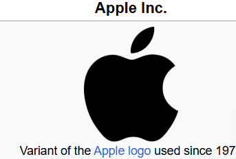

# Task for Day 1

## 1. HTML Headers

# Heading 1
## Heading 2
### Heading 3
#### Heading 4
##### Heading 5
###### Heading 6

---

## 2. HTML Lists

### Unordered List
- Apple
- Banana
- Mango

### Ordered List
1. First item
2. Second item
3. Third item

---

## 3. Text Formatting

**This is bold text**

*This is italic text*

==This is highlighted text==

---

## 4. Code Block (Python Hello World)

''' python
print("Hello, World!")
'''

